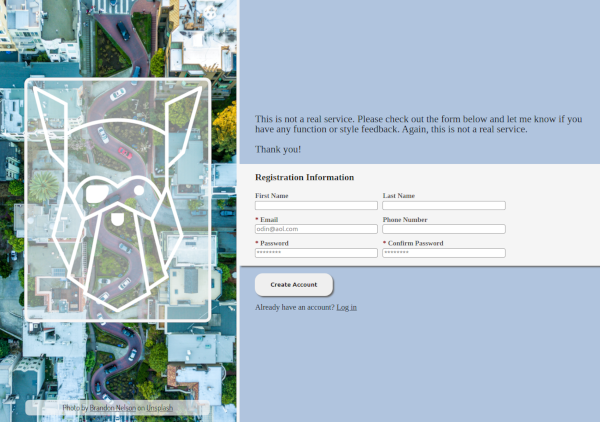
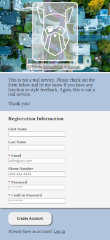

# Sign-up Form

## Project info

A sign up form for a fake service. The purpose of this project was to practice form validation, css styling, and mobile styling.

Project description can be found [here](https://www.theodinproject.com/lessons/intermediate-html-and-css-sign-up-form).

## Live demo

Live demo available [here](https://jcampbell57.github.io/odin-sign-up-form/)

## Table of Contents

* [Features](#features)
* [Technologies utilized](#technologies-utilized)
* [Learning outcomes](#learning-outcomes)
* [Project screenshot](#project-screenshot)
* [Behind the Scenes](#behind-the-scenes)
* [Installation](#installation)

## Features

- UI built to spec
- HTML5 Form Elements
- Form validation using JavaScript

## Technologies utilized

- HTML5
- CSS3
- JavaScript ES6

## Learning outcomes

This project helped to reinforce the following skills:

- Form validation
- JavaScript password validation
- CSS styling
- Mobile styling

## Project screenshots (desktop & mobile)

## Behind the scenes

### Improvements

This project could be improved with:

- specifying which specific password criteria is invalid within the Custom Validity

### Resources

- [This](https://cdn.statically.io/gh/TheOdinProject/curriculum/5f37d43908ef92499e95a9b90fc3cc291a95014c/html_css/project-sign-up-form/sign-up-form.png) is the example given to recreate.
- [CSS reset](https://meyerweb.com/eric/tools/css/reset/)

## Installation

- Clone this repository to your desktop.
- Navigate to the top level of the directory by running `cd odin-sign-up-form`.
- Open `index.html` in your browser.
